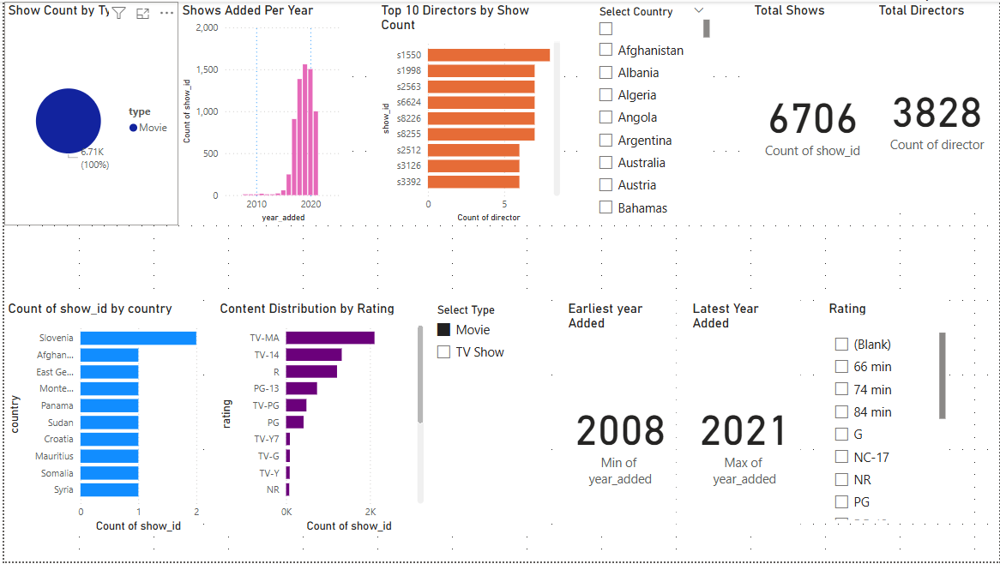
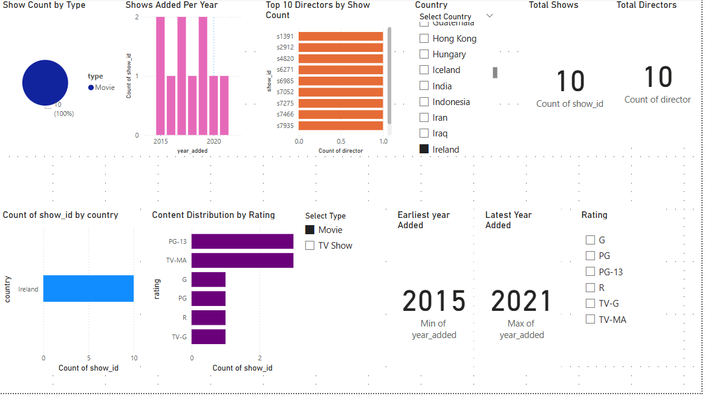
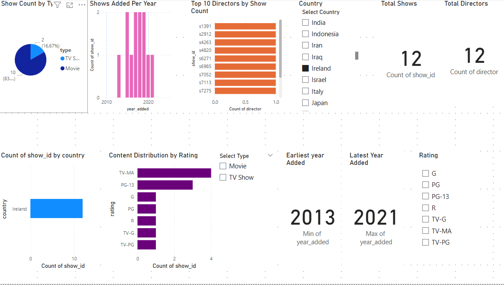

📊 Netflix Content Insights Dashboard

📝 Overview

This interactive Power BI dashboard provides visual insights into Netflix's content catalog. It helps explore trends based on type, release year, country, rating, and director activity.

📂 Tools Used
Power BI (for interactive dashboard)

Excel (for initial data formatting and cleaning)

📈 Key Features
🔍 Filters
Slicers to interactively explore:

Country

Content Type (Movie / TV Show)

Rating (TV-MA, PG, etc.)

📊 Visuals
Pie chart: Distribution by content type

Bar charts: Shows added per year, top 10 directors

Geo analysis: Shows count by country

Ratings: Show counts by audience rating

KPIs:

Total number of shows

Total unique directors

Earliest and latest content year

📷 Screenshots
Dashboard Preview

Slicers & KPIs
### 🔹 Main Dashboard

### 🔹 Movie Insights

### 🔹 TV Shows Insights

### 🔹 Country Drilldowns

**Afghanistan**

**Ireland – Movies**

**Ireland – TV Shows**

**Ireland – Total**

✅ Insights Gained
Most of Netflix’s content are Movies (~97%)

The highest number of shows were added between 2017 and 2020

Content is predominantly TV-MA rated

Top directors contributed to 5–7 titles each
